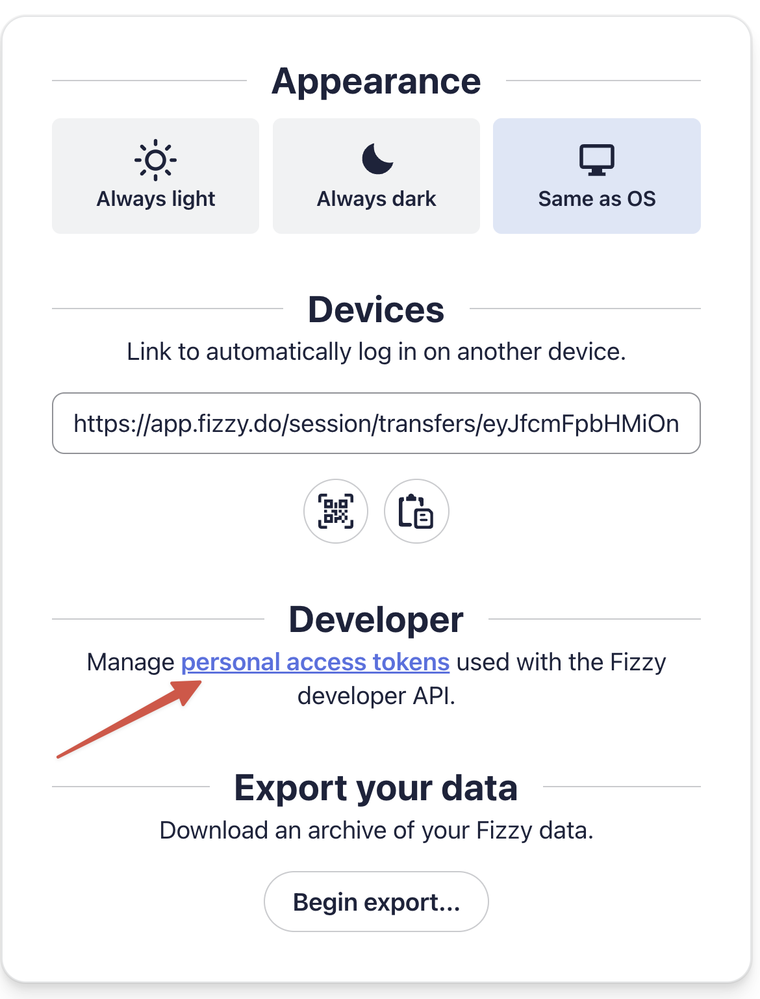

# Fizzy CLI

A Ruby command-line client for [Fizzy](https://fizzy.do) project management.

[](https://badge.fury.io/rb/fizzy-cli)
[](https://github.com/dpaluy/fizzy-cli/actions/workflows/ci.yml)

## Install

Requires Ruby >= 3.2.

```sh
gem install fizzy
```

## Authentication

### Getting a Personal Access Token

1. Log in to [app.fizzy.do](https://app.fizzy.do)
2. Open your profile settings (click your avatar)
3. Scroll to the **Developer** section
4. Click **personal access tokens**
5. Create a new token and copy it



### Logging in

```sh
fizzy auth login --token YOUR_TOKEN
```

Tokens are stored at `~/.config/fizzy-cli/tokens.yml`. You can also set `FIZZY_TOKEN` as an environment variable with `--account` to skip the file.

```sh
fizzy auth status     # Show current auth
fizzy auth accounts   # List available accounts
fizzy auth switch SLUG  # Change default account
```

## Usage

All commands support `--json` for JSON output and `--account SLUG` to override the default account.

```sh
# Use a different account
fizzy cards list --board BOARD_ID --account my-other-team
```

### Boards

```sh
fizzy boards list
fizzy boards get BOARD_ID
fizzy boards create "My Board"
fizzy boards update BOARD_ID --name "New Name"
fizzy boards delete BOARD_ID
```

### Cards

Cards are addressed by number (not ID).

```sh
fizzy cards list
fizzy cards list --board BOARD_ID --status open
fizzy cards get 42
fizzy cards create "Card title" --board BOARD_ID
fizzy cards update 42 --title "New title"
fizzy cards delete 42
```

Card actions:

```sh
fizzy cards close 42
fizzy cards reopen 42
fizzy cards not-now 42
fizzy cards triage 42 --column COLUMN_ID
fizzy cards untriage 42
fizzy cards tag 42 "bug"
fizzy cards assign 42 USER_ID
fizzy cards watch 42
fizzy cards unwatch 42
fizzy cards golden 42
fizzy cards ungolden 42
```

### Columns

Columns are scoped to a board.

```sh
fizzy columns list --board BOARD_ID
fizzy columns get COLUMN_ID --board BOARD_ID
fizzy columns create "To Do" --board BOARD_ID
fizzy columns update COLUMN_ID --board BOARD_ID --name "Done"
fizzy columns delete COLUMN_ID --board BOARD_ID
```

### Steps

Steps are scoped to a card (no list endpoint; steps appear in `cards get`).

```sh
fizzy steps create "Write tests" --card 42
fizzy steps get STEP_ID --card 42
fizzy steps update STEP_ID --card 42 --completed
fizzy steps delete STEP_ID --card 42
```

### Comments

```sh
fizzy comments list --card 42
fizzy comments get COMMENT_ID --card 42
fizzy comments create "Looks good" --card 42
fizzy comments update COMMENT_ID --card 42 --body "Updated"
fizzy comments delete COMMENT_ID --card 42
```

### Reactions

Works on cards and comments.

```sh
fizzy reactions list --card 42
fizzy reactions list --card 42 --comment COMMENT_ID
fizzy reactions create "thumbsup" --card 42
fizzy reactions delete REACTION_ID --card 42
```

### Tags, Users, Notifications, Pins

```sh
fizzy tags list
fizzy users list
fizzy users get USER_ID
fizzy notifications list
fizzy notifications read NOTIFICATION_ID
fizzy notifications mark-all-read
fizzy pins pin 42
fizzy pins unpin 42
```

### Other

```sh
fizzy auth identity   # Show current user info
fizzy version    # Print version
fizzy help       # List all commands
```

## Error Handling

```ruby
begin
  # any fizzy command
rescue Fizzy::AuthError => e
  # 401 - invalid or expired token
rescue Fizzy::ForbiddenError => e
  # 403 - insufficient permissions
rescue Fizzy::NotFoundError => e
  # 404 - resource not found
rescue Fizzy::ValidationError => e
  # 422 - invalid input
rescue Fizzy::RateLimitError => e
  # 429 - too many requests, retry with backoff
rescue Fizzy::ServerError => e
  # 500+ - server error
rescue Fizzy::NetworkError => e
  # Timeout or connection failure
end
```

## Configuration

| Source | Purpose |
|--------|---------|
| `~/.config/fizzy-cli/tokens.yml` | Stored auth tokens and default account |
| `FIZZY_TOKEN` env var | Token override (requires `--account`) |

## Development

```
bundle install
bundle exec rake        # runs tests + rubocop
bundle exec rake test   # tests only
bundle exec rubocop     # lint only
```

## AI Agent Integration

Fizzy CLI ships with a [skill file](skills/fizzy-cli/SKILL.md) that teaches AI coding assistants how to use the CLI. Install it so agents can manage your Fizzy boards and cards autonomously.

The `fizzy` gem must be installed and authenticated first:

```sh
gem install fizzy-cli
fizzy auth login --token YOUR_TOKEN
```

```sh
fizzy skill install                          # Claude Code, user-level (default)
fizzy skill install --target codex           # OpenAI Codex / OpenCode
fizzy skill install --target all             # All supported agents
fizzy skill install --scope project          # Project-level instead of user-level
fizzy skill uninstall                        # Remove skill file
```


## Contributing

Bug reports and pull requests are welcome on GitHub at https://github.com/dpaluy/fizzy-cli.

## License

The gem is available as open source under the terms of the [MIT License](https://opensource.org/licenses/MIT).
